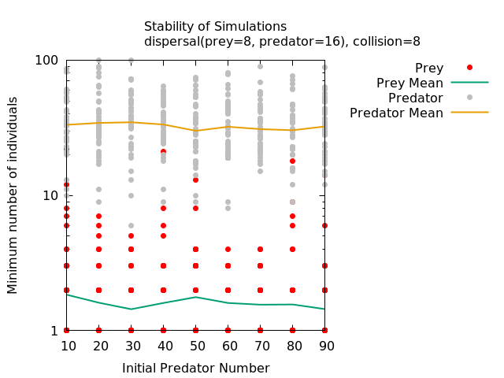

# Community Ecology Semester Project

## Introduction


### Table of contents

- [The Individual-Based Model used for simulations](#The-Individual-Based-Model)
- [The IBM Results](#Results-1)
- [The Equivalent ODE System](#The-Equivalent-ODE-System)
- [The ODE Results](#Results-2)
- [Comparison](#Comparison)
- [Tools and Supporting Information](#Tools)


## The Individual-Based Model

The model used here is modified from the [predatorpreywithplot.py](https://sourceforge.net/projects/pycx/files/PyCX-0.1/) file of the [PyCX Project](http://pycx.sourceforge.net/) compiled with Python 2.7. The code from the predatorpreywithplot.py file has been modified in several ways, but mainly to enable parallel computing of the simulations using the python **multiprocessing** library.

### Initialisation
The Individual-Based Model even though it ressembles the above described system is fondamentaly different because individuals are directly modelled on a spatially explicit 100x100 grid. All simulations are initialized placing all prey and predator individuals on the grid using an uniform distribution, ~ U<sup>2</sup> (0, max grid height) (0, max grid width).

### Model Structure
For each time step in the Individual-Based Model those actions are performed:
- All individuals disperse across the grid [Dispersion](#Dispersion-of-Individuals)
- All possible predation events are resolved across the grid [Predation](#Predation)
- Dead individuals, from predation and background mortality, are removed from the grid [Background Mortality](#Background-Mortality)
- All reproduction events are resolved [Reproduction](#Reproduction)

### Parameter Complete Table
| Name    | Category           | Default Value  |
| ------------- |:-------------:| -----:|
| Width | Environment | 250 |
| Height | Environment | 250 |
| Maximum Time Step | Simulation | 1000 |
| Initial Population | Prey | 500 |
| Reproduction Rate | Prey | 0.3 |
| Population Limit (K) | Prey | 500 |
| Dispersal Ability | Prey | 8 |
| Initial Population | Predator | 100 |
| Reproduction Rate | Predator | 0.3 |
| Population Limit (K) | Predator | 500 |
| Dispersal Ability | Predator | 16 |
| Background Mortality Rate | Predator | 0.03 |
| Minimum Predation Distance | Predator | 8 |


### Dispersion of Individuals
Every individuals move according the a single parameter, ```NoiseLevel```, which corresponds to their dispersal ability. For each time step each individual moves from its current position with a value obtained from a gaussian distribution ~ N (O, ```NoiseLevel```). The borders of the grid are limiting: individuals moving beyond the maximum height and width are kept at the limits of the grid.

### Predation
Predation events are defined by the variable called ```collisionDistance``` that sets the maximum distance for which predation can occur.
If the distance between a predator and a prey is less than the square of the value of ```collisionDistance``` a predation event occurs:
<p align="center">(x<sub>R</sub> - x<sub>P</sub>)<sup>2</sup> + (y<sub>R</sub> - y<sub>P</sub>)<sup>2</sup> < D</p>

with D = ```collisionDistance```<sup>2</sup>
For one time step a predator will consume all the prey individuals within his reach.

### Background Mortality
Background Mortality is only included in the model for the predator with the term m, as showed in the equations system above. This is implemented in the model as follow: a random number from a uniform distribution, ~ U (0,1), is drawed and compared to the value of the ```BackgroundMortality``` variable. Therefore a predator dies under the condition:
<p align="center"> BackgroundMortality > random</p>

### Reproduction
The reproduction events are modelled by a random sampling between 0 and 1. The condition for a successfull reproduction event is:
<p align="center">r<sub>X</sub> ( 1 - X/K<sub>X</sub> ) > random</p>
With X being either the prey or predator.
For the predator there is an additional condition for a reproduction event to occur: the predator is able to reproduce only after a successful predation event. This is why the reproduction rate is scaled by the predation term, &alpha;RP, for the predator's dyanmics.
This rule corresponds to energy limitation, there is a limited pool of energy that can be allocated to anything other than survival, as reproduction, so the individuals need to have enough energy or prey biomass consumed to be able to attempt a reproduction event.


## Results 1


## The Equivalent ODE System

The system modeled presents two species R, the resource and P, the predator. The system dynamics can be written as follows:

<p align="center">
dR/dt = r<sub>R</sub> ( 1 - R/K<sub>R</sub>) - &alpha;RP </p>
<p align="center">
dP/dt = r<sub>P</sub>&alpha;RP ( 1 - P/K<sub>P</sub>) -m
</p>

With r<sub>R</sub> and r<sub>P</sub> the respective reproduction rate, K<sub>R</sub> and K<sub>P</sub> the carrying capacities of respectively the prey and predator. The term &alpha;RP corresponds to the predation term which is present in the prey's equation, each predation event depletes the prey population, and in the predator's equation, the predator individuals in order to reproduce need to have enough energy that is to have consumed a prey not long before. The term m is the intrinsec background mortality for the predator.


## Results 2


## Comparison


## Tools

### Gnuplot Visualisation Help
This [gnuplot script](/files/gnuplot) produces the below graph to help determine if coexistence is achieved giving a certain parameter value, here the predator's initial population number. This script uses the output of the [simulations summary tables](/files/sim_summary_fox_initpop1.csv)


### Grid Visualisation Help
DONE IN GNUPLOT


### Aggregation Index
This model is used to investigate how aggregation of prey individuals can modify the atbility of the system. To measure aggregation on the spatial grid we implement the **aggregation index**, **AI**, defined as follow:
<p align="center"> AI = [g<sub>ii</sub> / max(g<sub>ii</sub>) ] 100</p>

With g<sub>ii</sub> and max(g<sub>ii</sub>)


## TO DO

### The Equivalent ODE System
Modifying the ODE system presented in the special case of K<sub>R</sub> = K<sub>P</sub>, r<sub>R</sub> = r<sub>P</sub> and m = r<sub>P</sub>/10 yields the following conditions for stabiltiy:

- Show how this simplification changes the theoretical stability of the system.

### Invasibility of the System
Run simulations with low initial prey population and verify that theoretical invasibility criteria are or not violated.

### Spatial Aggregation

- Find a metric for spatial aggregation of prey individuals
- Test it and make a visual verification of consistency
- Include it in the simulations output


